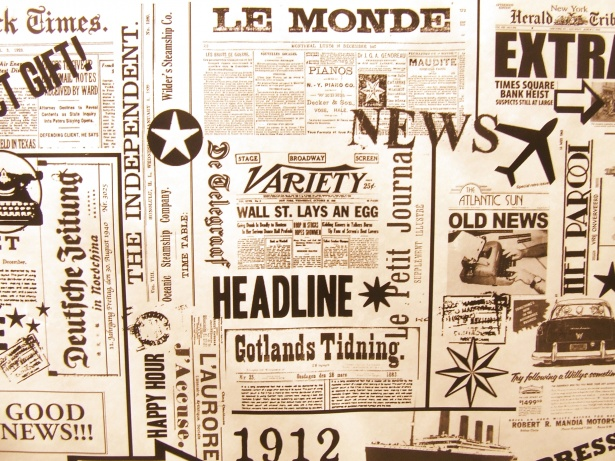
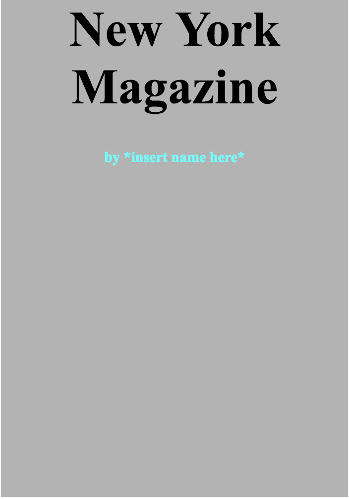
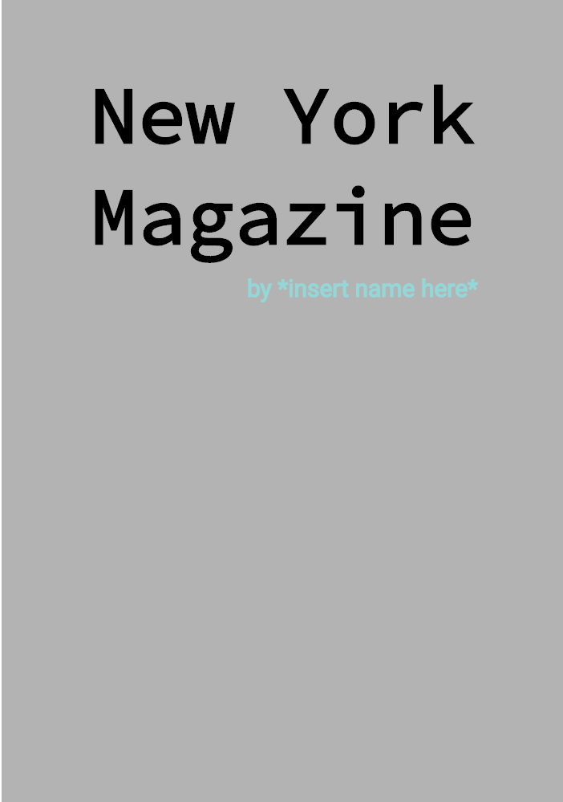
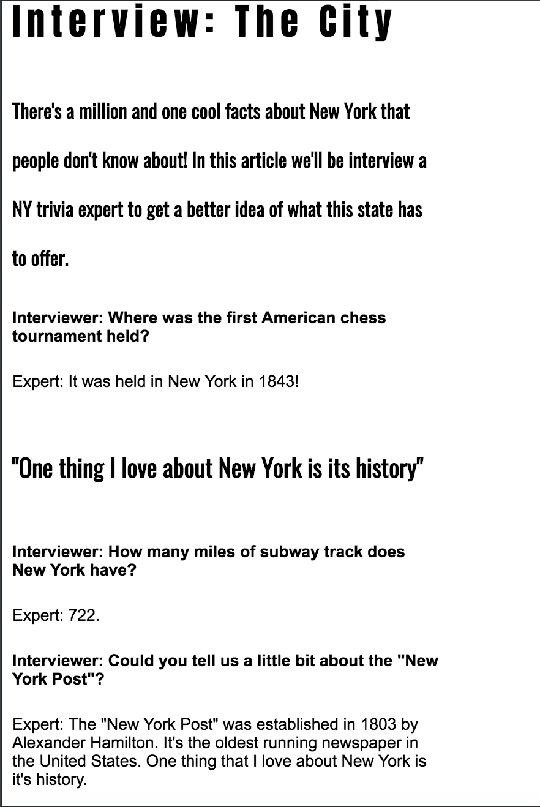
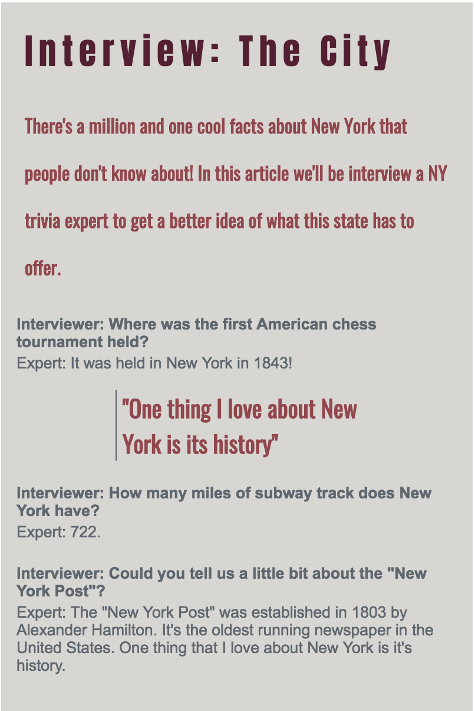

# Extra, Extra, Read all about it!

## The Goal

As we all know, New York is a pretty amazing state. In this lab we're going to honor the place we can all call home and a mockup of a magazine full of information about New York.

## The Lab
The mockup you're going to create already has the html written for it, but you'll be writing the css rulesets needed to make it look like the mockups you'll see below. Each page of the magazine will be in its own HTML file and therefore have its own corresponding css stylesheet. Check out the details below to get started!

#### The Cover

###### Draft One
For the first draft of the cover for the magazine, you've been asked to match the mockup shown below. This image can also be found in the mockups folder and is named basic_cover.png.

The html for this page is in cover.html and you will be writing style rules in cover.css. In your styling make sure to pay attention to the...
* **size** of the text.
* **color** of the text.
* **alignment** of the text on the page.
* **background color** of the page.
The height and width of your cover(as well as the selector for this rule) have already been created for you in cover.css! Check out the file and have fun styling!

###### Draft Two
After examining your cover further, you realize it could do with something more. What way to make it more fun than add a cool font! Navigate to [this link](https://fonts.google.com/specimen/Source+Code+Pro?selection.family=Lato|Source+Code+Pro).The correct font families have already been selected for you. Click on the black Family Selected bar. The link tag needed to import these fonts is already in your html file.

After clicking on the bar you'll see two example css rules that you can copy to use these fonts! Still working in cover.css, work on adding the style rules you need to match the mockup below!

For this mockup you'll want to focus in on:
* **margin** and **padding** around text. Use the inspec15t tool to help you see where the existing padding and margin is around elements!
* **font** of text.
* **opacity** of text.

###### Draft Three
Now that your text is looking fantastic, you've realized that the main area of your cover is looking a little bland. For this draft we're going to change up the html a little to add a new image for you to style. Head into the cover.html file and uncomment the img tag on line 13. When you do this, you should see an image appear on your page.

Write some styling for this image in cover.css to make your page match the mockup below!

 in your CSS. Your title will use Anton font, your intro and block quote will use Oswald, and your interview questions and answers will use Railway. Focus on the font properties discussed above to get your html sheet looking like this first draft of your article page!

###### Draft Two
Now that we have our fonts looking amazing, let's get back onto spacing our items on the page and adding some color. You'll be using the colors from [this color scheme](https://coolors.co/4c5760-d3d0cb-839788-461220-8c2f39) to design your page. Focus on using the same properties that you did on the cover (**width**, **padding**, **margin**) to shape the white space around your text.

When you have your text placed well, add in the small border to the block quote to take your styling up another level.

#### The Challenge

You've explored a ton of fun CSS properties in this lab, but the thankfully there's even more! Pick at least three of the CSS properties listed below and find a way to use them to make your pages look even more ~amazing~. Use this amazing [resource](https://www.w3schools.com/css/default.asp) for a better idea of what the properties below will allow you to do! Scroll down on the sidebar until you see advanced css and then click on the properties you're interested in.

* border-radius
* background-image(with an image)
* background-image(with a gradient)
* box-shadow
* text-shadow
* border-image
